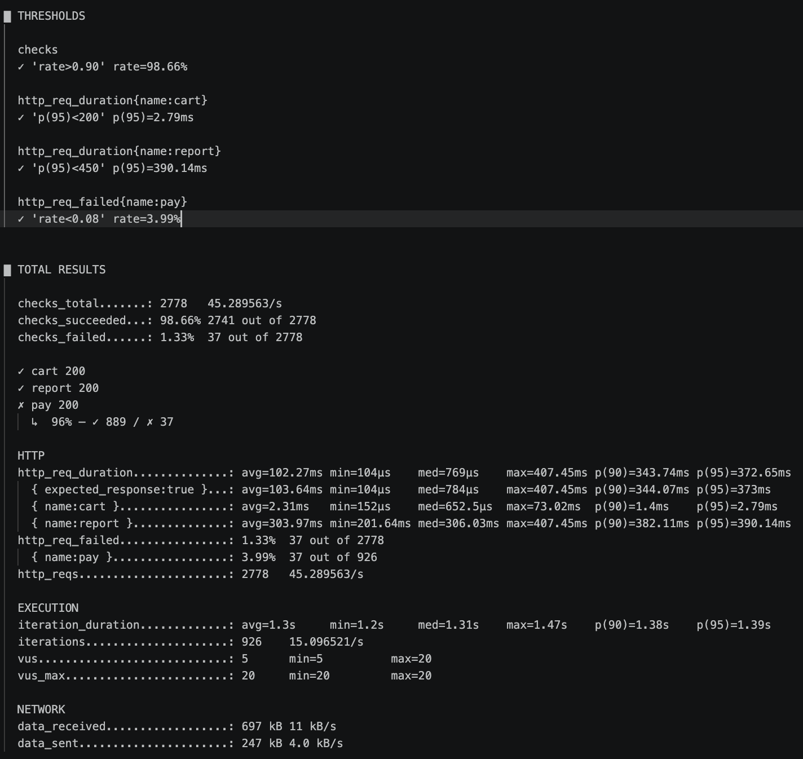
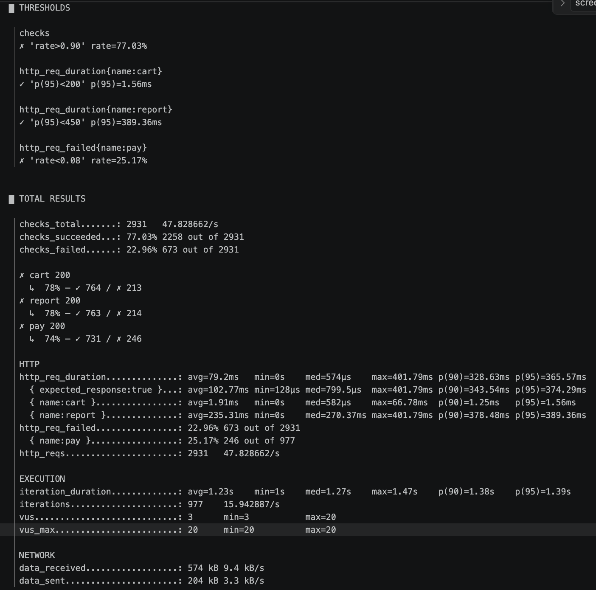
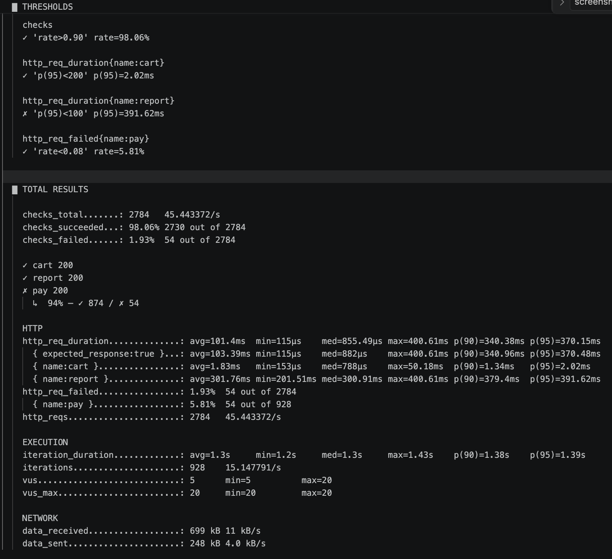

# F.CSA313 Программ хангамжийн чанарын баталгаа ба туршилт — Lab 03

**Оюутан:** Ц.Бэлгүтэй
**Оюутны код:** B232270053

## Зорилго

Энэхүү лабораторийн ажлын зорилго нь системийн чанарын шаардлагыг Quality Scenario хэлбэрээр тодорхойлж, тэдгээрт тохирох SLI болон SLO-г сонгон, k6 ашиглан threshold хэлбэрээр автоматаар шалгах явдал юм. Мөн хэвийн ажиллагааны үед threshold PASS болохыг баталгаажуулж, chaos туршилтаар системийн availability болон reliability-д үзүүлэх нөлөөг шалгахад оршино. Үүний зэрэгцээ зориудаар хэт хатуу threshold үүсгэн FAIL үр дүн болон k6-ийн exit code-ийг баталгаажуулж хийсэн байгаа.

## Test target

Лабораторийн туршилтад Node.js болон Express ашиглан локал орчинд ажиллуулсан REST API системийг ашиглав.

**Server:** `http://localhost:3000`

Систем нь дараах 3 endpoint-тэй.

| Endpoint    | Method | Зориулалт                      |
| ----------- | ------ | ------------------------------ |
| `/cart/add` | POST   | Сагсанд бараа нэмэх            |
| `/report`   | GET    | Удаан ажиллагаатай тайлан авах |
| `/pay`      | POST   | Төлбөр боловсруулах            |

### Endpoint-ийн онцлог

* `/cart/add` — хурдан хариу өгдөг endpoint.
* `/report` — `200–400 ms` санамсаргүй сааталтай.
* `/pay` — ойролцоогоор `5%` магадлалтайгаар `500` алдаа буцаадаг.

## Environment

* **OS:** macOS
* **Runtime:** Node.js
* **Framework:** Express.js
* **Load testing tool:** k6
* **k6 version:** `k6 v2.2.0 `
* **Test server:** `localhost:3000`
* **Normal load:** 20 VU
* **Normal test duration:** 1 минут
* **Chaos test duration:** 2 минут

## API verification

Server ажиллаж байгаа эсэхийг дараах хүсэлтүүдээр шалгасан.

```bash
curl -X POST http://localhost:3000/cart/add
```

```bash
curl http://localhost:3000/report
```

```bash
curl -X POST http://localhost:3000/pay
```

# Baseline Test

Threshold сонгохоос өмнө системийн хэвийн ажиллагааны baseline тестийг 20 VU, 1 минутын хугацаанд ажиллуулсан.

Baseline тестийн үед нийт HTTP request-ийн p95 latency `372.52 ms` байсан. Мөн `/report` endpoint нь серверийн кодоор зориудаар `200–400 ms` latency үүсгэдэг тул нийт latency-д нөлөөлж байгаа нь харагдсан.

Baseline үр дүн болон endpoint бүрийн зориулалтыг харгалзан SLO threshold-үүдийг тодорхойлсон. `/cart/add` нь хурдан endpoint тул `p95 < 200 ms`, `/report` нь зориудаар удаашруулсан endpoint тул `p95 < 450 ms`, `/pay` нь тодорхой хэмжээний random error үүсгэдэг тул `error rate < 8%` гэсэн босго сонгосон.

**Result file:** `results/baseline.txt`


# Quality Scenarios

## Scenario 1 — Cart нэмэх үеийн performance

### 1. Тойм

Хэрэглэгч сагсанд бараа нэмэх үед систем богино хугацаанд хариу өгч, хэрэглэгчийн үйлдлийг саатуулахгүй байх шаардлагатай.

### 2. Системийн төлөв

API server хэвийн ажиллаж байгаа бөгөөд 20 VU зэрэг хүсэлт илгээж байна.

### 3. Орчны төлөв

Локал macOS орчинд Node.js + Express server ажиллаж байгаа бөгөөд k6 ачааллын тест ажиллуулна.

### 4. Гадаад өдөөлт

Хэрэглэгчид `/cart/add` endpoint руу `POST` хүсэлтүүдийг зэрэг илгээнэ.

### 5. Шаардлагатай хариу

Систем хүсэлтийг амжилттай боловсруулж, богино хугацаанд `200 OK` хариу өгөх ёстой.

### 6. Хэмжүүр

* **SLI:** `/cart/add` endpoint-ийн p95 response time
* **SLO:** p95 `< 200 ms`

---
## Scenario 2 — Report performance

### 1. Тойм

Хэрэглэгч тайлан авах үед систем хариуг боломжийн хугацаанд буцааж, хэт их саатал үүсгэхгүй байх шаардлагатай.

### 2. Системийн төлөв

API server хэвийн ажиллаж байгаа бөгөөд 20 VU зэрэг хүсэлт илгээж байна.

### 3. Орчны төлөв

Локал macOS орчинд Node.js + Express server ажиллаж байгаа бөгөөд k6 ачааллын тестийг 1 минутын хугацаанд ажиллуулна.

### 4. Гадаад өдөөлт

Хэрэглэгчид `/report` endpoint руу `GET` хүсэлтүүдийг зэрэг илгээнэ.

### 5. Шаардлагатай хариу

Систем тайлангийн хүсэлтийг амжилттай боловсруулж, p95 response time нь тодорхойлсон SLO-оос хэтрэхгүй байх ёстой.

### 6. Хэмжүүр

* **SLI:** `/report` endpoint-ийн p95 response time

* **SLO:** p95 `< 450 ms`

## Scenario 3 — Төлбөрийн reliability

### 1. Тойм

Төлбөр боловсруулах үед системийн алдааны түвшин зөвшөөрөгдөх хэмжээнээс хэтрэхгүй байх шаардлагатай.

### 2. Системийн төлөв

API server ажиллаж байгаа бөгөөд `/pay` endpoint руу зэрэг олон хүсэлт ирж байна.

### 3. Орчны төлөв

20 VU ашиглан 1 минутын турш k6 тест ажиллуулна.

### 4. Гадаад өдөөлт

Хэрэглэгчид `/pay` endpoint руу `POST` хүсэлтүүдийг зэрэг илгээнэ.

### 5. Шаардлагатай хариу

Төлбөрийн хүсэлтүүдийн ихэнх нь амжилттай боловсруулагдаж, алдааны түвшин SLO-оос хэтрэхгүй байх ёстой.

### 6. Хэмжүүр

* **SLI:** `/pay` endpoint-ийн error rate
* **SLO:** error rate `< 8%`

---

## Scenario 4 — Системийн availability

### 1. Тойм

Системд гэнэтийн outage буюу холболтын тасалдал үүссэн үед үйлчилгээний availability зөвшөөрөгдөх түвшнээс доош орохгүй байх шаардлагатай.

### 2. Системийн төлөв

20 VU систем рүү зэрэг хүсэлт илгээж байгаа үед server-ийн ажиллагаанд зориудаар тасалдал үүсгэнэ.

### 3. Орчны төлөв

Chaos туршилтыг 2 минутын хугацаанд ажиллуулж, системийн endpoint-үүдэд хүсэлтүүд үргэлжлүүлэн илгээнэ.

### 4. Гадаад өдөөлт

API server-ийн ажиллагааг түр тасалдуулж, хүсэлтүүдэд `connection refused` зэрэг алдаа үүсгэнэ.

### 5. Шаардлагатай хариу

Системийн availability нь тодорхойлсон SLO-оос доош орохгүй байх ёстой. Хэрэв outage-ийн хугацаа эсвэл амжилтгүй хүсэлтийн хэмжээ зөвшөөрөгдөх хэмжээнээс хэтэрвэл threshold FAIL болох ёстой.

### 6. Хэмжүүр

* **SLI:** Successful checks / total checks
* **SLO:** availability `> 90%`
* **Chaos test window:** 2 минут

---

# SLO and Thresholds

| Scenario            | SLI                     | SLO / Threshold | Test               |
| ------------------- | ----------------------- | --------------- | ------------------ |
| Cart performance    | `/cart/add` p95 latency | `< 200 ms`      | 20 VU, 1 min       |
| Report performance  | `/report` p95 latency   | `< 450 ms`      | 20 VU, 1 min       |
| Payment reliability | `/pay` error rate       | `< 8%`          | 20 VU, 1 min       |
| System availability | Successful checks       | `> 90%`         | 20 VU, 2 min chaos |

### Threshold сонгосон шалтгаан

`/cart/add` endpoint-ийн performance-д `p95 < 200 ms` threshold сонгосон. Энэ нь хурдан endpoint учраас хэрэглэгчийн үйлдэлд мэдэгдэхүйц саатал үүсгэхгүй байх шаардлагыг шалгана.

`/report` endpoint нь зориудаар `200–400 ms` сааталтай тул `p95 < 450 ms` threshold сонгосон. Ингэснээр endpoint-ийн төлөвлөсөн latency-ийн дээд хязгаарт бага хэмжээний margin үлдээсэн.

`/pay` endpoint нь серверийн кодоор ойролцоогоор `5%` алдаа үүсгэдэг. Иймээс random variation-ийг тооцон `error rate < 8%` гэсэн SLO сонгосон.

Availability-ийн хувьд `> 90%` гэсэн SLO ашигласан. Энэ нь хамгийн ихдээ `10%`-ийн request/time error budget үлдээж байна.

---

# Threshold implementation

Үндсэн threshold тестийг `slo-test.js` файлд хэрэгжүүлсэн.

```js
thresholds: {
  'http_req_duration{name:cart}': ['p(95)<200'],
  'http_req_failed{name:pay}': ['rate<0.08'],
  'http_req_duration{name:report}': ['p(95)<450'],
  'checks': ['rate>0.90'],
},
```

Үндсэн тестийн тохиргоо:

```js
export const options = {
  vus: 20,
  duration: '1m',
};
```

Ингэснээр хэвийн SLO тест нь 20 VU-тайгаар 1 минут ажиллана.

---

# PASS result

Үндсэн SLO threshold тестийг дараах командаар ажиллуулсан.

```bash
k6 run slo-test.js | tee results/pass.txt
```

Тестийн бүх threshold амжилттай биелсэн.

### Үр дүн

| Metric         | Actual result |  Threshold | Result |
| -------------- | ------------: | ---------: | ------ |
| Checks         |        98.66% |    `> 90%` | PASS   |
| Cart p95       |       2.79 ms | `< 200 ms` | PASS   |
| Report p95     |     390.14 ms | `< 450 ms` | PASS   |
| Pay error rate |         3.99% |     `< 8%` | PASS   |

Нийт:

* **Total requests:** 2778
* **Iterations:** 926
* **Checks succeeded:** 98.66%
* **Checks failed:** 1.33%

**Result file:** `results/pass.txt`


---

# Chaos Experiment

Availability болон reliability-ийн SLO-г системийн тасалдлын үед шалгахын тулд 2 минутын chaos туршилт хийсэн.

### Chaos procedure

Chaos туршилтыг 20 VU, 2 минутын хугацаатайгаар ажиллуулсан. k6 тест эхэлснээс хойш ойролцоогоор 30 секундын дараа Express server-ийг `Ctrl+C` ашиглан түр зогсоосон. Server-ийг ойролцоогоор 10 секунд ажиллуулахгүй байлгасны дараа `node server.js` командаар дахин ажиллуулсан. Server зогссон хугацаанд k6-ийн хүсэлтүүд амжилтгүй болж, `connection refused` төрлийн алдаа үүссэн. Server дахин ажилласны дараа хүсэлтүүд дахин хэвийн боловсруулагдсан.

Ингэснээр бодит server outage үүсгэж, уг тасалдлын үеийн availability болон payment reliability-ийн өөрчлөлтийг k6 ашиглан хэмжсэн.

**Result file:** `results/chaos.txt`



Chaos туршилтын үед server-ийн ажиллагаанд зориудаар тасалдал үүсгэснээр хүсэлтүүдийн тодорхой хэсэг амжилтгүй болсон.

### Chaos result

| Metric                | Actual result |  Threshold | Result |
| --------------------- | ------------: | ---------: | ------ |
| Checks / Availability |        77.03% |    `> 90%` | FAIL   |
| Cart p95              |       1.56 ms | `< 200 ms` | PASS   |
| Report p95            |     389.36 ms | `< 450 ms` | PASS   |
| Pay error rate        |        25.17% |     `< 8%` | FAIL   |

Chaos туршилтын үед:

* **Total requests:** 2931
* **Checks succeeded:** 77.03%
* **Checks failed:** 22.96%
* **Pay error rate:** 25.17%

Ингэснээр availability болон payment reliability-ийн threshold хоёулаа зөрчигдсөн.

---

# Request-based Error Budget

Availability SLO:

```text
Availability > 90%
```

Тиймээс зөвшөөрөгдөх алдааны хэмжээ:

```text
100% - 90% = 10%
```

Chaos туршилтын нийт хүсэлт:

```text
2931
```

Зөвшөөрөгдөх хамгийн их failed request:

```text
2931 × 0.10 = 293.1
```

Харин k6-ийн бүртгэсэн бодит failed checks:

```text
673 out of 2931 checks
```

Тиймээс:

```text
Allowed ≈ 293 failed checks
Actual  ≈ 673 failed checks
```

Бодит failed checks нь зөвшөөрөгдөх error budget-ээс давсан байна. Иймээс request-based availability SLO **FAIL** болсон.

---

# Time-based Error Budget

Chaos туршилтын хугацаа:

```text
2 minutes = 120 seconds
```

Availability SLO нь `90%` тул зөвшөөрөгдөх downtime:

```text
120 × 0.10 = 12 seconds
```

Иймээс 2 минутын туршилтын үед time-based error budget нь:

**12 секунд**

Туршилтын үед outage ойролцоогоор 10 секунд байсан тул time-based error budget-ийн хувьд 12 секундээс хэтрээгүй.

Гэхдээ request-based availability нь 90%-аас доош орсон тул тухайн туршилтын availability threshold FAIL болсон.

---

# Availability vs Reliability

Availability болон reliability нь хоорондоо холбоотой боловч ижил хэмжүүр биш.

**Availability** нь систем хэрэглэгчийн хүсэлтийг ерөнхийдөө амжилттай хүлээн авч, үйлчилгээ үзүүлж байгаа эсэхийг хэмждэг. Энэ лабораторид availability-г `checks rate > 90%` гэж тодорхойлсон.

**Reliability** нь тодорхой үйлдэл, тухайлбал төлбөр боловсруулах үед алдаа хэр их гарч байгааг хэмждэг. Энэ лабораторид `/pay` endpoint-ийн error rate `< 8%` байх шаардлагатай.

Chaos туршилтын үед availability `77.03%` болж, availability threshold FAIL болсон. Мөн `/pay` endpoint-ийн error rate `25.17%` болж reliability threshold мөн FAIL болсон.

Иймээс нэг outage нь хоёр хэмжүүрт зэрэг сөрөг нөлөө үзүүлж болох боловч availability болон reliability нь өөр өөр чанарын шинжийг хэмжиж байна.

---

# FAIL Threshold Test

Threshold хэрхэн FAIL болж байгааг баталгаажуулахын тулд `/report` endpoint-ийн threshold-ийг зориудаар хэт хатуу болгосон.

`Slo-test-fail.js` файлд:

```js
'http_req_duration{name:report}': ['p(95)<100'],
```

гэж өөрчилсөн.

Туршилтыг дараах командаар ажиллуулсан:

```bash
k6 run slo-test-fail.js 2>&1 | tee results/fail.txt; echo "k6_exit=${pipestatus[1]}"
```

### FAIL result

| Metric         | Actual result |  Threshold | Result |
| -------------- | ------------: | ---------: | ------ |
| Checks         |        98.06% |    `> 90%` | PASS   |
| Cart p95       |       2.02 ms | `< 200 ms` | PASS   |
| Report p95     |     391.62 ms | `< 100 ms` | FAIL   |
| Pay error rate |         5.81% |     `< 8%` | PASS   |

`/report` endpoint-ийн бодит p95:

```text
391.62 ms
```

харин threshold:

```text
p(95) < 100 ms
```

тул threshold биелээгүй.

k6 дараах алдааг мэдээлсэн:

```text
thresholds on metrics 'http_req_duration{name:report}' have been crossed
```

Мөн командын төгсгөлд:

```text
k6_exit=99
```

гэж гарсан.

Ингэснээр threshold FAIL болсон үед k6 нь `99` exit code буцааж байгааг баталгаажуулсан.

**Result file:** `results/fail.txt`


---

# Results Summary

| Test           | Checks | Cart p95 | Report p95 | Pay error | Overall |
| -------------- | -----: | -------: | ---------: | --------: | ------- |
| PASS           | 98.66% |  2.79 ms |  390.14 ms |     3.99% | PASS    |
| Chaos          | 77.03% |  1.56 ms |  389.36 ms |    25.17% | FAIL    |
| FAIL threshold | 98.06% |  2.02 ms |  391.62 ms |     5.81% | FAIL    |

PASS тестээр систем хэвийн нөхцөлд тодорхойлсон SLO-уудыг хангаж байгааг шалгасан.

Chaos тестээр системийн availability болон payment reliability тасалдлын үед хэрхэн өөрчлөгдөж байгааг шалгасан.

FAIL тестээр threshold-ийг зөрчсөн үед k6 автоматаар FAIL төлөв үүсгэж, `99` exit code буцааж байгааг баталгаажуулсан.

---

# Дүгнэлт

Энэхүү лабораторийн ажлаар Quality Scenario-оос SLI, SLO болон k6 threshold хүртэлх чанарын шалгалтын pipeline-г хэрэгжүүлсэн. Системийн `/cart/add`, `/report`, `/pay` гэсэн гурван endpoint дээр өөр өөр чанарын шаардлага тодорхойлсон. Хэвийн 20 VU, 1 минутын тестээр бүх threshold PASS болсон бөгөөд cart-ийн p95 latency 2.79 ms, report-ийн p95 latency 390.14 ms, payment-ийн error rate 3.99% гарсан. Chaos туршилтын үед системийн availability 77.03% болж, 90%-ийн SLO-г хангаагүй. Мөн payment-ийн error rate 25.17% болж 8%-ийн reliability SLO-оос давсан. Request-based error budget-ийн тооцоогоор зөвшөөрөгдөх хэмжээ ойролцоогоор 293 failed checks байсан боловч бодит failed checks 673 болсон. Харин 2 минутын time-based availability error budget нь 12 секунд бөгөөд туршилтын outage энэ хугацаанаас хэтрээгүй. Availability болон reliability нь хоорондоо холбоотой боловч тусдаа чанарын хэмжүүр болохыг chaos туршилтын үр дүнгээр харуулсан. Эцэст нь report endpoint-д зориудаар `p(95)<100 ms` гэсэн хэт хатуу threshold тавихад бодит p95 нь 391.62 ms гарч FAIL болсон бөгөөд k6 `99` exit code буцаасан.

# Files

* `server.js` — Express API server
* `slo-test.js` — үндсэн SLO threshold тест
* `slo-test-fail.js` — зориудаар FAIL болгох threshold тест
* `results/baseline.txt` — baseline тестийн output
* `results/pass.txt` — PASS тестийн output
* `results/chaos.txt` — chaos тестийн output
* `results/fail.txt` — FAIL тестийн output
* `results/pic2.png` — PASS k6 тестийн screenshot
* `results/pic3.png` — chaos тестийн screenshot
* `results/pic4.png` — FAIL threshold тест болон `k6_exit=99` screenshot
* `.gitignore` — `node_modules` болон `.DS_Store`-ийг Git-д оруулахгүй